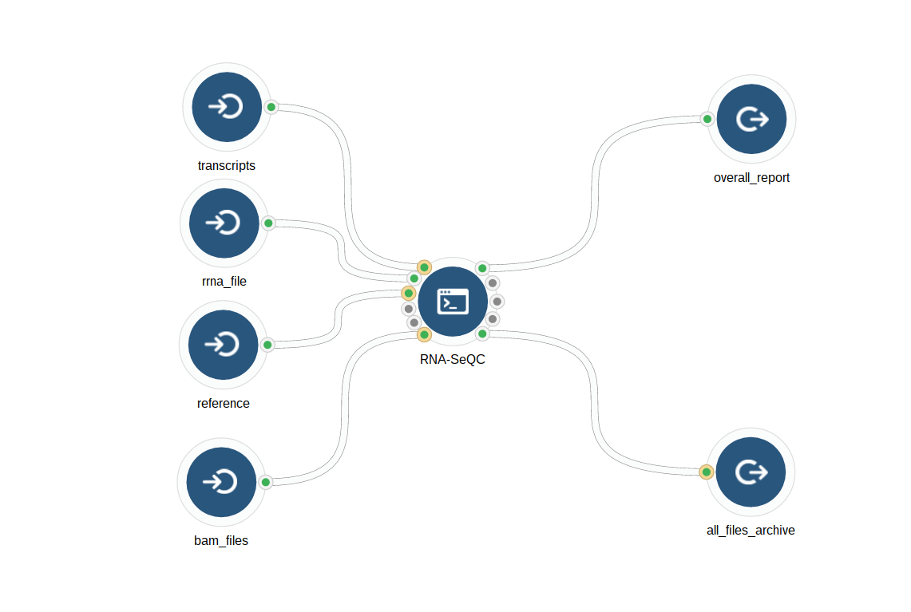
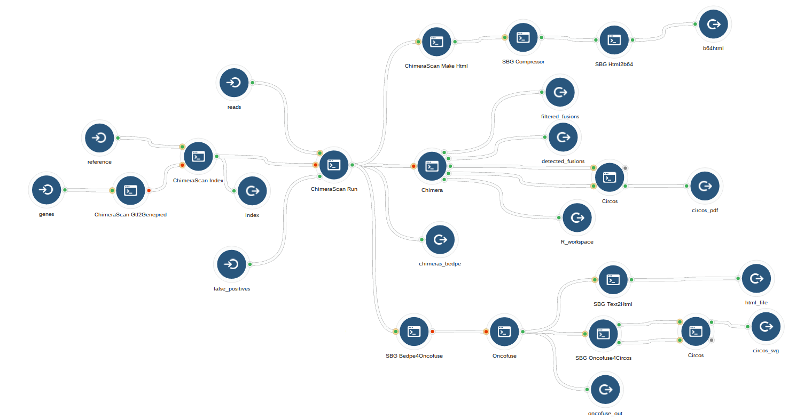
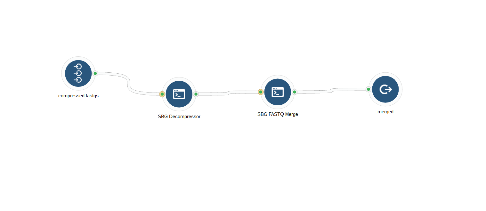

```{r setup, include=FALSE}
require(tidyverse); require(readxl);
knitr::opts_chunk$set(echo = TRUE)
```

Chats | [cgrlab Gitter](https://gitter.im/cgrlab/cgrRNA) | [teamcgc slack channel](https://teamcgc.slack.com/messages/cgr_rna/)

<hr>

Workflows Included in this Whole Transcriptome Analysis Pipeline  

* Aligment and QC  
    * STAR and Dedupication
    * RNA-SeQC
    * Multiple Sample QC Metric Wrangler
* mRNA Fusions
    * ChimeraScan / Chimera / Oncofuse
        * Preprocessing with Fastq decompress and merge
    * Multiple Sample Evidence based Fusion Summary Tool
        * Coming soon
* Differential Expression
    * cuff quant / cuff diff
    * Ht-seq / DESeq2

  


## Workflow Graphs

### 1.  Alignment and Deduplication

<a href="images/star_alignment_and_deduplication.png" target="_blank">
  
</a>

### 2.  RNA-SeQC

<a href="images/rna-seqc.png" target="_blank">
  
</a>

### 3.  QC Metrics Wrangler

<a href="images/qc_metrics_wrangler.png" target="_blank">
  
</a>

### Fusions

<a href="images/chimera_scan.png" target="_blank">
  
</a>

### Other Utility Workflows

### Fastq decompress and merge

<a href="images/fastq_decompress_and_merge.png" target="_blank">
  
</a>


```{r echo=FALSE}
meta = read_excel("references/_SBG_set metadata info for RD168 WTx.xlsx")
```


