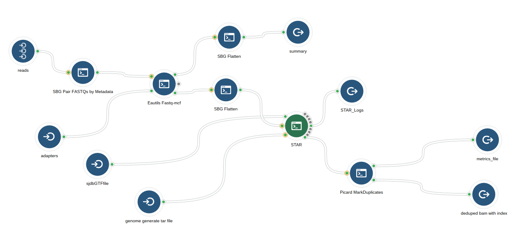

```{r setup, include=FALSE}
require(tidyverse); require(readxl);
knitr::opts_chunk$set(echo = TRUE)
```


Chats | [Public Gitter Chat](https://gitter.im/cgrlab/cgrRNA) | [teamcgc slack channel](https://teamcgc.slack.com/messages/cgr_rna/)

<hr>


## Workflow Graphs

### 1.  Alignment and Deduplication

<a href="images/star_alignment_and_deduplication.png" target="_blank">
  
</a>


## Metadata Template

```{r echo=FALSE}
meta = read_excel("references/_SBG_set metadata info for RD168 WTx.xlsx")
```


