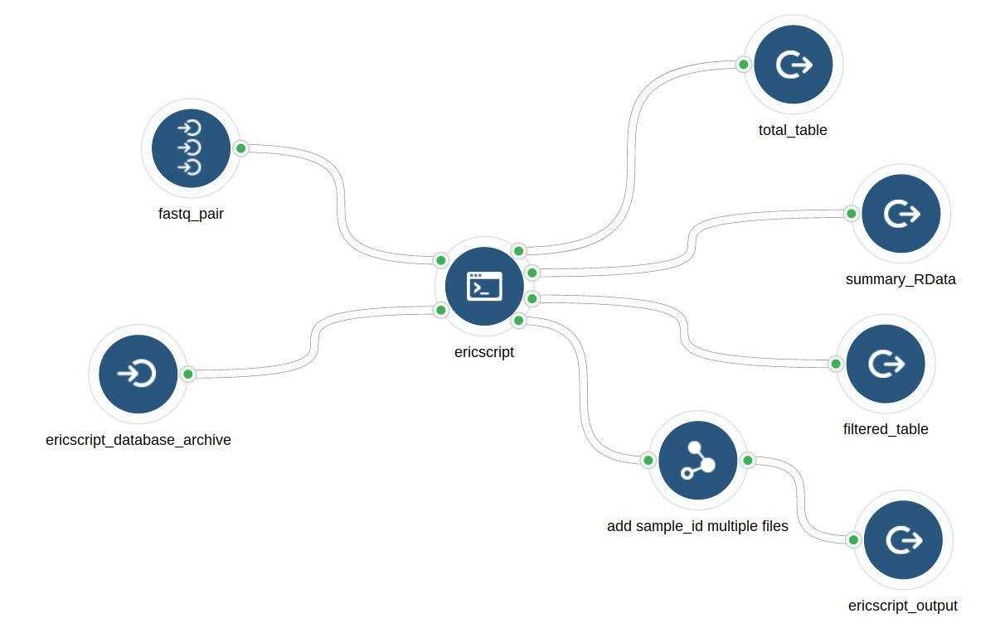
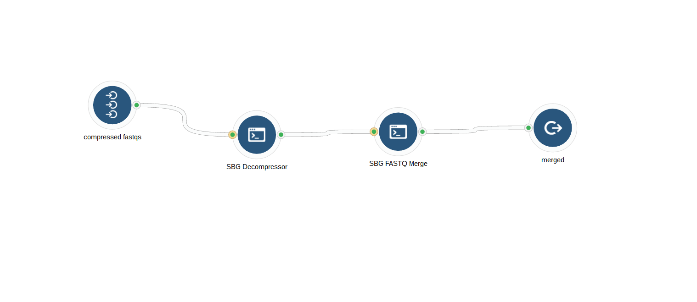

```{r include = FALSE}
require(tidyverse); require(rmarkdown); require(knitr); require(sevenbridges); 

options(max.print = "99"); opts_knit$set(width = 99)
opts_chunk$set(cache=FALSE, tidy=FALSE)

source("~/cgrRNA/scratch/cgc_auth.R")

```


## File naming conventions

All fusion output files follow the same naming schema which is the concatenation of the Sample ID, Fusion tool name, and then file extension.
 
e.g. SA01234_chimerascan_output.bedpe, SA01234_ericscript_output.txt
 
All files will be tab delimited.

## EricScript



## STAR-Fusion with alignment


## STAR-Fusion by itself


## fastq_decompress_and_merge



