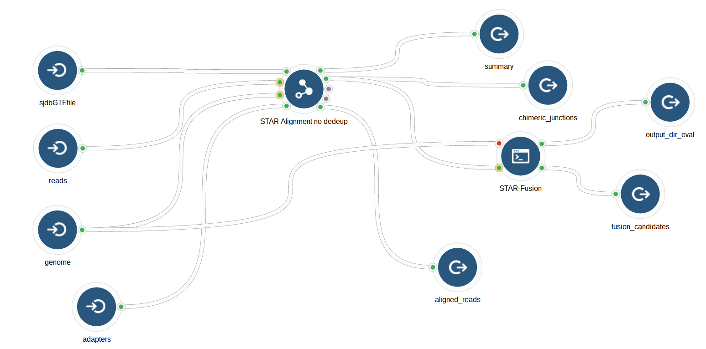
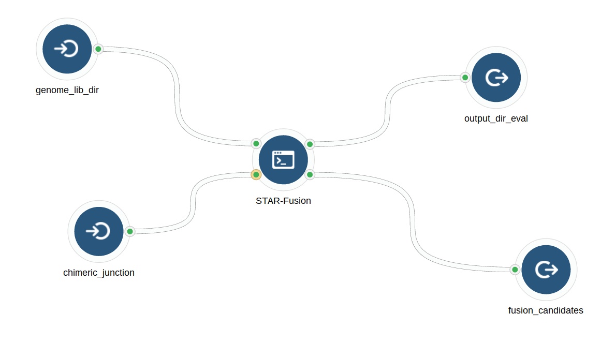

STAR-Fusion WF
================

-   [Workflow Graphs](#workflow-graphs)
    -   [STAR-Fusion with alignment](#star-fusion-with-alignment)
    -   [STAR-Fusion Only](#star-fusion-only)
-   [CTAT Database](#ctat-database)

Workflow Graphs
---------------

### STAR-Fusion with alignment

Example of a workflow withing a wofklow.

### STAR-Fusion Only

CTAT Database
-------------

Download the CTAT database from

<https://data.broadinstitute.org/Trinity/CTAT_RESOURCE_LIB/>

The GRch37 version can also be found in the cgrRNA SBG project (restricted access)

GRCh37\_gencode\_v19\_CTAT\_lib\_July272016.tar.gz

<https://igor.sbgenomics.com/u/dave/cgrrna/files/5827c8c1e4b0a15a0466c1ba/>

GRCh37\_gencode\_v19\_CTAT\_lib.tar.gz

<https://igor.sbgenomics.com/u/dave/cgrrna/files/5827db26e4b0a15a0466c1c6/>
